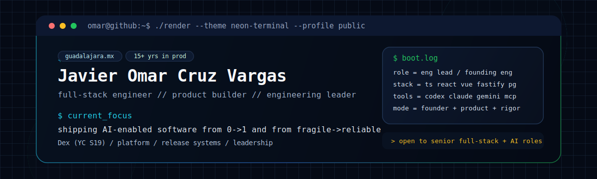

<p align="center">
  
</p>

<p align="center">
  <code>full-stack engineer</code>
  <code>product builder</code>
  <code>engineering leader</code>
  <code>founder DNA</code>
</p>

```bash
omar@github:~$ whoami
Javier Omar Cruz Vargas

omar@github:~$ cat profile.txt
Head of Engineering / Founding Engineer at Dex (YC S19)
15+ years building production software across product, platform, and infrastructure
Based in Guadalajara, Mexico

omar@github:~$ ./focus --verbose
- AI-enabled product engineering
- 0->1 execution and scaling systems
- Frontend + backend + DevOps ownership
- Engineering hiring, velocity, and quality guardrails
```

## `cast("about")`

Full-Stack Engineer with founder DNA. I like hard systems problems, ambitious products, and teams that ship with intent. I build reliable software end-to-end: architecture, implementation, infrastructure, release pipelines, and the operating rhythm around them.

My default mode is part builder, part operator, part terminal goblin.

## `spellbook.ts`

<p>
  
  
  
  
  
  
  
  
  
  
  
</p>

```txt
ai_tooling = [
  "Claude Code",
  "Codex",
  "Gemini CLI",
  "OpenClaw",
  "OpenRouter",
  "MCP servers",
  "AI skills"
]
```

## `timeline.log`

| Era | Quest |
| --- | --- |
| `2019 -> now` | **Dex (YC S19)** — Head of Engineering / Founding Engineer. Rebuilt the platform, led migration to `Fastify + PostgreSQL`, implemented CI/CD in a Turborepo monorepo with GitHub Actions, built the official MCP Server and AI Skill, and helped scale from `$0 -> $1M+ ARR`. |
| `2017 -> 2019` | **Rever** — Senior Full-Stack Engineer. Joined early, helped scale engineering from `2 -> 10`, built product features across frontend and backend, and founded internal tooling. |
| `2015 -> 2017` | **Lesi** — CTO & Founder. Built the company, hired the team, shipped the product, and handled technical strategy with fundraising support. |
| `before that` | **Kukumi, Kbyte, Basiko, Organizala.com, Universidad de Guadalajara, Pan American Games Guadalajara 2011** — a long trail of shipped systems, founder experiments, and web engineering reps. |

## `side_quests.md`

- Built products across Dex, Rolodex, and Lebra.
- Shipped payments plus Gmail, Calendar, and Outlook sync.
- Wrote the mini book `Introduction to MEAN`.
- Taught HTML, CSS, and JavaScript in two 6-month courses at Instituto Tecnologico Superior de Zapopan.
- Native Spanish speaker, conversational in English.

## `open_portal.sh`

```bash
omar@github:~$ echo $INTERESTS
senior_full_stack_roles ai_enabled_product_engineering platform_leadership

omar@github:~$ mailto
ocruzvar@gmail.com
```

If you're building something ambitious, weird, useful, or all three: [`ocruzvar@gmail.com`](mailto:ocruzvar@gmail.com)
